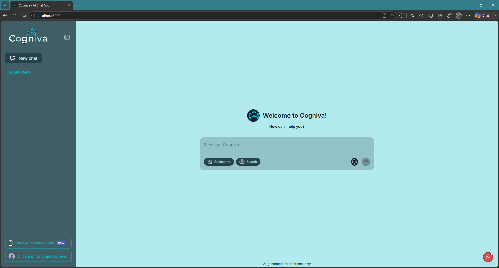

# Cogniva

`(Cognition + Viva)`



## Getting Started

First, download to your local workspace:

```bash
git clone https://github.com/OtakuTotipotent/cogniva.git
# or fork the repo on github (after forking)
git clone https://github.com/username/repo-name
# pull future updates (add remote)
git remote add upstream https://github.com/OtakuTotipotent/cogniva.git
# pull future updates (pull changes)
git pull upstream main
```

Second, run the development server:

```bash
npm run dev
# or
yarn dev
# or
pnpm dev
# or
bun dev
```

Open [http://localhost:3000](http://localhost:3000) with your browser to see the result.

You can start editing the project.

This project uses [`next/font`](https://nextjs.org/docs/app/building-your-application/optimizing/fonts) to automatically optimize and load [Geist](https://vercel.com/font), a new font family for Vercel.

## Learn More

To learn more about Next.js, take a look at the following resources:

- [Next.js Documentation](https://nextjs.org/docs) - learn about Next.js features and API.
- [Learn Next.js](https://nextjs.org/learn) - an interactive Next.js tutorial.

You can check out [the Next.js GitHub repository](https://github.com/vercel/next.js) - your feedback and contributions are welcome!

## Author

Best regards [`Afnan Muhammad`](https://github.com/OtakuTotipotent)
